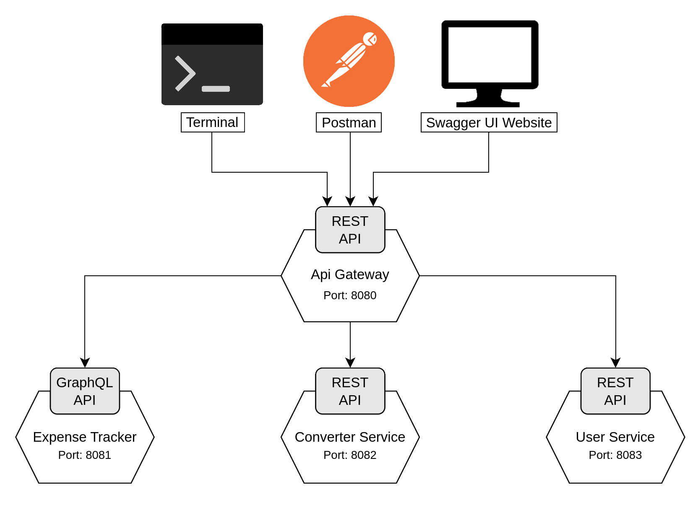

# Ausgaben Manager: Dokumentation

## Projektbeschreibung

Der **Ausgabentracker** ist eine Webanwendung zur Verwaltung von Finanzen. Die Anwendung ermöglicht es Benutzern, ihre **Ausgaben** zu erfassen und Währungen in **Echtzeit** umzurechnen. Nutzer können Ausgaben hinzufügen, aktualisieren, löschen und nach verschiedenen Kriterien filtern. Eine Benutzerverwaltung stellt sicher, dass nur autorisierte Nutzer auf ihre jeweiligen Daten zugreifen können. Die Bedienung erfolgt über die Konsole, der Webseite Swagger UI oder Postman.

## Features

- Verwaltung Ausgaben mit Kategorisierung
- Echtzeit-Währungsumrechnung für verschiedene Währungen
- Intuitive Bedienung über Konsole, Swagger UI oder Postman
- API Gateway zur zentralen Steuerung der Services

## Projektarchitektur

Die Anwendung basiert auf einer **Microservice-Architektur** mit folgenden Hauptkomponenten:

- Die **Api Gateway** dient als zentraller eingangspunkt für die Anwendung und kommuniziert mit den anderen Webservicen um die Anfragen von den Clients zu erfüllen.  
Port: 8080  
Schnittstellen: REST  
[Link zur Dokumentation](ApiGatewayService/README.md)

- Der **Expense Tracker Service** bietet eine GraphQL-Schnittstelle zur Verwaltung von Ausgaben. Er ermöglicht das Abrufen, Erstellen, Aktualisieren und Löschen von Ausgaben für verschiedene Benutzer.  
Port: 8081  
Schnittstellen: GraphQL  
[Link zur Dokumentation](ExpensesTrackerService/README.md)

- Der **Converter Service** stellt eine API zur Währungsumrechnung zur Verfügung. Mit ihm können Benutzer Währungsbeträge zwischen verschiedenen Währungen konvertieren und sich über unterstützte Währungen informieren.  
Port: 8082  
Schnittstellen: REST  
[Link zur Dokumentation](ConverterService/README.md)

- Der **User Service** ermöglicht die Verwaltung von Benutzern über eine REST-API. Er unterstützt grundlegende Operationen wie das Erstellen, Abrufen, Auflisten und Löschen von Benutzern  
Port: 8083  
Schnittstellen: REST  
[Link zur Dokumentation](UserService/README.md)





## Technologien & Werkzeuge

- **Backend**: Java mit Spring Boot
- **API Typen**: REST API & GraphQL, CurrencyLayer API (extern)
- **Entwicklungsumgebung**: Visual Studio Code

## Installation & Setup

### Voraussetzungen

- Java
- Git
- Visual Studio Code

### Lokale Installation

**Repository klonen**
   ```bash
   git clone https://github.com/WebApps-WiSe-24/webapp-mdm
   cd webapp-mdm
   ```

## Nutzung

Stellen Sie sicher, dass der Server läuft, bevor Sie versuchen, den Service zu nutzen. Alle vier Spring Boot Anwendungen müssen dazu gestartet werden.
   

### Zugriff über Swagger UI
Durch **Swagger UI** bietet unsere Webanwendung eine interaktive und benutzerfreundliche Oberfläche um die Endpunkte zu durchsuchen und Anfragen zu stellen. Folgen Sie diesen einfachen Schritten, um die Swagger UI zu nutzen:

1. **Swagger UI öffnen**  
   - Starten Sie den API Gateway-Dienst.  
   - Rufen Sie Swagger UI im Browser auf: http://localhost:8080/swagger-ui/index.html
     
2. **API-Endpunkte testen**  
   - Wählen Sie einen Endpunkt aus der Liste.  
   - Klicken Sie auf **"Try it out"** und geben Sie die erforderlichen Parameter ein.  
   - Führen Sie die Anfrage mit **"Execute"** aus.  
   - Überprüfen Sie die Antwort im unteren Bereich der Swagger UI.


#### **API-Endpunkte & Funktionen**

| Methode | Endpunkt | Beschreibung |
|---------|-------------------------------------|---------------------------------------------|
| **GET**    | `/api/users/{userId}/expenses/{expenseId}` | Holt eine einzelne Ausgabe eines Nutzers. |
| **PUT**    | `/api/users/{userId}/expenses/{expenseId}` | Aktualisiert eine Ausgabe eines Nutzers. |
| **DELETE** | `/api/users/{userId}/expenses/{expenseId}` | Löscht eine bestimmte Ausgabe eines Nutzers. |
| **GET**    | `/api/users` | Ruft eine Liste aller Benutzer ab. |
| **POST**   | `/api/users` | Erstellt einen neuen Benutzer. |
| **GET**    | `/api/users/{userId}/expenses` | Listet alle Ausgaben eines Nutzers auf. |
| **POST**   | `/api/users/{userId}/expenses` | Erstellt eine neue Ausgabe für einen Nutzer. |
| **GET**    | `/api/users/{userId}` | Holt die Informationen eines bestimmten Nutzers. |
| **DELETE** | `/api/users/{userId}` | Löscht einen Benutzer. |
| **GET**    | `/api/users/{userId}/categories/{category}` | Holt die Gesamtausgaben einer bestimmten Kategorie. |
| **GET**    | `/api/users/{userId}/categories/sum` | Holt die Gesamtausgaben aller Kategorien für einen Nutzer. |

---

### Zugriff über Postman

#### Voraussetzungen
- Installiere [Postman](https://www.postman.com/downloads/)
- Stelle sicher, dass dein Webservice läuft

#### Nutzung

1. Öffne Postman und erstelle eine neue Anfrage.
2. Wähle die HTTP-Methode (z.B. `GET`, `POST`).
3. Gib die URL des Endpunkts ein, z.B. `http://localhost:8080/api/users`.
4. Falls erforderlich, füge einen Request-Body im JSON-Format hinzu.
5. Klicke auf "Send" und überprüfe die Antwort des Servers.

#### API-Anfragen
Die folgende Tabelle zeigt die möglichen API-Anfragen:

| Methode  | Endpunkt                                      | Beschreibung                                 | Beispiel-Request-Body | Unterstützt `?currency=` |
|----------|----------------------------------------------|---------------------------------------------|----------------------|------------------------|
| `GET`    | `/api/users`                                | Alle Benutzer abrufen                      | -                    | Nein                   |
| `GET`    | `/api/users/{userId}`                      | Einen Benutzer anhand der ID abrufen       | -                    | Nein                   |
| `POST`   | `/api/users`                                | Einen neuen Benutzer erstellen             | `{ "name": "Max", "email": "max@example.com" }` | Nein                   |
| `DELETE` | `/api/users/{userId}`                      | Einen Benutzer löschen                     | -                    | Nein                   |
| `GET`    | `/api/users/{userId}/expenses`             | Alle Ausgaben eines Benutzers abrufen      | -                    | Ja                     |
| `GET`    | `/api/users/{userId}/expenses/{expenseId}` | Eine bestimmte Ausgabe abrufen             | -                    | Ja                     |
| `POST`   | `/api/users/{userId}/expenses`             | Eine neue Ausgabe hinzufügen               | `{ "category": "Food", "value": 50.0, "currency": "EUR" }` | Nein                   |
| `PUT`    | `/api/users/{userId}/expenses/{expenseId}` | Eine bestehende Ausgabe aktualisieren      | `{ "category": "Transport", "value": 60.0, "currency": "USD" }` | Nein                   |
| `DELETE` | `/api/users/{userId}/expenses/{expenseId}` | Eine Ausgabe löschen                       | -                    | Nein                   |
| `GET`    | `/api/users/{userId}/categories/sum`       | Gesamtausgaben nach Kategorie abrufen      | -                    | Ja                     |
| `GET`    | `/api/users/{userId}/categories/{category}`| Ausgaben für eine bestimmte Kategorie abrufen | -                | Ja                     |

---
### Zugriff über Konsole

Sie können den Webservice mittels `cURL` in der Konsole nutzen. 
Ersetzen dazu in den unteren Beispielen `{userId}`, `{expenseId}`, `{category}` und `{currency}` mit den jeweiligen tatsächlichen Werten.

#### Verwaltung der Nutzer

1. Alle Benutzer abrufen
    ```sh
    curl -X GET http://localhost:8080/api/users -H "Accept: application/json"
    ```

2. Benutzer nach ID abrufen
    ```sh
    curl -X GET http://localhost:8080/api/users/{userId} -H "Accept: application/json"
    ```

3. Neuen Benutzer erstellen
    ```sh
    curl -X POST http://localhost:8080/api/users \
        -H "Content-Type: application/json" \
        -d '{"name": "Max Mustermann", "email": "max@example.com"}'
    ```

4. Benutzer löschen
    ```sh
    curl -X DELETE http://localhost:8080/api/users/{userId} -H "Accept: application/json"
    ```

#### Verwaltung der Ausgaben

1. Alle Ausgaben eines Benutzers abrufen
    ```sh
    curl -X GET http://localhost:8080/api/users/{userId}/expenses -H "Accept: application/json"
    ```

    Optional: Währungskonvertierung hinzufügen:
    ```sh
    curl -X GET "http://localhost:8080/api/users/{userId}/expenses?currency={currency}" -H "Accept: application/json"
    ```

2. Einzelne Ausgabe abrufen
    ```sh
    curl -X GET http://localhost:8080/api/users/{userId}/expenses/{expenseId} -H "Accept: application/json"
    ```

    Optional: Währungskonvertierung hinzufügen:
    ```sh
    curl -X GET http://localhost:8080/api/users/{userId}/expenses/{expenseId}?currency={currency}" -H "Accept: application/json"
    ```

3. Neue Ausgabe hinzufügen
    ```sh
    curl -X POST http://localhost:8080/api/users/{userId}/expenses \
        -H "Content-Type: application/json" \
        -d '{"amount": 100.0, "category": "Food", "description": "Dinner at restaurant"}'
    ```

4. Bestehende Ausgabe aktualisieren
    ```sh
    curl -X PUT http://localhost:8080/api/users/{userId}/expenses/{expenseId} \
        -H "Content-Type: application/json" \
        -d '{"amount": 120.0, "category": "Food", "description": "Updated dinner expense"}'
    ```

5. Ausgabe löschen
    ```sh
    curl -X DELETE http://localhost:8080/api/users/{userId}/expenses/{expenseId} -H "Accept: application/json"
    ```

#### Zusammenfassun der Ausgaben nach Kategorien

1.  Gesamtausgaben nach Kategorie abrufen
    ```sh
    curl -X GET http://localhost:8080/api/users/{userId}/categories/sum -H "Accept: application/json"
    ```

    Optional: Währungskonvertierung hinzufügen:
    ```sh
    curl -X GET "http://localhost:8080/api/users/{userId}/categories/sum?currency={currency}" -H "Accept: application/json"
    ```

2.  Ausgaben einer bestimmten Kategorie abrufen
    ```sh
    curl -X GET http://localhost:8080/api/users/{userId}/categories/{category} -H "Accept: application/json"
    ```

    Optional: Währungskonvertierung hinzufügen:
    ```sh
    curl -X GET "http://localhost:8080/api/users/{userId}/categories/{category}?currency={currency}" -H "Accept: application/json"
    ```


## Roadmap

- Verbesserung der Konsolenausgabe
- Erweiterung der Analysemöglichkeiten
- Unterstützung für Kryptowährungen

## Beitragende

- Emre Bugday (EmoBu)
- Meeraf Golja (Meeraf1)
- Daniel Barranco Delgado (danielbarrancodelgado)
- Jean-Gabriel Hanania (jghanania)


